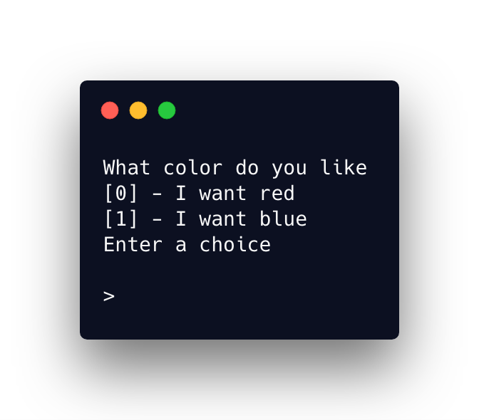

# Lentil

Your dart CLI wizard.



## Getting Started

These instructions will get you a copy of the project up and running on your local machine for development and testing purposes.

1. Clone repo
2. Run `pub get`
3. Execute `main.dart` in the `example` directory.

```dart
import 'package:lentil/lentil.dart';

void main() {
  final options = [
    new Option('I want red', '#f00'),
    new Option('I want blue', '#00f'),
  ];
  final prompter = new Prompter();

  final String colorCode =
      prompter.askMultiple("What color do you like", options);
  final bool isCakeLover = prompter.askBinary("Do you like cake?");

  print(colorCode);
  print(isCakeLover);
}

```

## Built With

- [Dart](https://www.dartlang.org/) - Language
